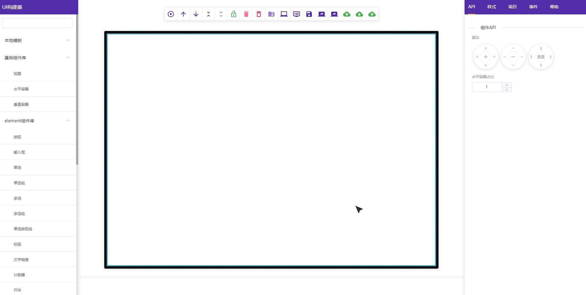

# guitor
> web构建器

[项目预览](https://mobov.github.io/guitor/)

#### 说明
基于Vue对Vue组件做可视化布局的web构建项目

#### 特性

[x] 适用于任意UI组件库，只需要编写对应的组件API声明，可以参照目录下 library-element-ui/index.js  
[x] 布局简化切分为视图, 容器, 盒结构；基于flex布局API，单独封装成@guitor/base-ui UI库，项目只需导入该基础组件库  
[x] 任意组件组合可以保存为一个新的模板做复用  
[x] 支持导出虚拟节点，VUE SFC, HTML, 和项目工程, 可导入导出工程做反复编辑  

